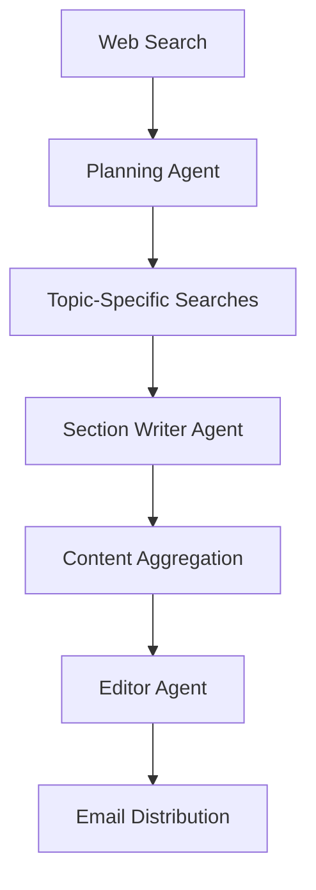

# Newsletter Agent Spring AI

An intelligent, AI-powered newsletter generation system that automatically creates, curates, and distributes newsletters using multiple AI agents and web search integration.

## 📖 Overview

Newsletter Agent Spring AI is an autonomous newsletter creation system that leverages the power of artificial intelligence to:

- **🔍 Research**: Automatically search the web for relevant and trending topics
- **📋 Plan**: Use AI agents to analyze content and create structured newsletter plans  
- **✍️ Write**: Generate high-quality newsletter sections using AI-powered writing
- **✏️ Edit**: Polish and finalize content with AI-driven editing capabilities
- **📧 Distribute**: Automatically send newsletters via email

The system operates on a multi-agent architecture where specialized AI agents collaborate to produce professional newsletters with minimal human intervention.

## 🏗️ Architecture

The system follows a workflow-based architecture with the following key components:

### Core Components

#### 🤖 AI Agents
- **PlanningAgent**: Analyzes web search results and creates structured newsletter plans
- **SectionWriterAgent**: Writes individual newsletter sections based on research and topics
- **EditorAgent**: Performs final editing, polishing, and triggers email distribution

#### 🔧 Services
- **WorkflowOrchestrator**: Coordinates the entire newsletter creation workflow
- **TavilyService**: Handles web search functionality via Tavily API integration
- **EmailService**: Manages newsletter distribution via SMTP (also functions as Spring AI tool)

#### 📊 Data Models
- **TopicFormat**: Structured format for newsletter planning with title and topics
- **TavilySearch/TavilyResponse**: Web search request/response models
- **Various converters**: Format converters for AI structured output

### Workflow Process



1. **Initial Search**: Performs web search for AI-related topics using Tavily API
2. **Planning**: AI analyzes results and creates structured newsletter plan
3. **Research**: Conducts targeted searches for each planned topic
4. **Writing**: Generates newsletter sections in parallel for performance
5. **Editing**: Finalizes content and handles email distribution
6. **Distribution**: Sends newsletter via configured email service

## 🚀 Features

### 🤖 AI-Powered
- Multi-agent AI workflow using OpenAI models via OpenRouter
- Intelligent content planning and structure generation
- High-quality writing with consistent style and tone
- Automated editing and quality assurance

### 🔍 Web Research
- Integration with Tavily API for AI-optimized search results
- Configurable search parameters (time ranges, content types)
- Parallel processing for multiple topic research

### 📧 Email Integration
- Automatic newsletter distribution via SMTP
- HTML email support with rich formatting
- Spring AI tool integration for intelligent sending decisions

### ⚡ Performance & Reliability
- Parallel section writing for improved performance
- Robust error handling with graceful degradation
- Comprehensive logging for monitoring and debugging
- Configurable scheduling (weekly by default)

### 🔧 Configurable
- Environment-based configuration for API keys
- Customizable prompt templates for AI behavior
- Flexible email and search settings
- Docker-ready with external configuration support

## 📋 Prerequisites

- **Java 21** or higher
- **Gradle 8.x** (included via wrapper)
- **SMTP Server** access for email distribution
- **API Keys** for:
  - OpenRouter (for OpenAI models)
  - Tavily (for web search)

## 🛠️ Installation & Setup

### 1. Clone the Repository
```bash
git clone https://github.com/willdom-kahari/newsletter-agent-spring-ai.git
cd newsletter-agent-spring-ai
```

### 2. Environment Configuration

Create a `.env` file or set environment variables:

```bash
# OpenAI/OpenRouter Configuration
OPENROUTER_KEY=your_openrouter_api_key

# Tavily Search Configuration  
TAVILY_API_KEY=your_tavily_api_key

# Email Configuration
EMAIL_HOST=smtp.your-provider.com
EMAIL_PORT=587
EMAIL_USERNAME=your-email@domain.com
EMAIL_PASSWORD=your-email-password
EMAIL_RECIPIENT=recipient@domain.com
```

### 3. Build the Application
```bash
./gradlew build
```

### 4. Run the Application
```bash
./gradlew bootRun
```

Or run the JAR directly:
```bash
java -jar build/libs/newsletter-agent-spring-ai-0.0.1-SNAPSHOT.jar
```

## ⚙️ Configuration

### Application Properties

Key configuration options in `application.properties`:

```properties
# Application name
spring.application.name=newsletter-agent-spring-ai

# OpenAI Configuration (via OpenRouter)
spring.ai.openai.api-key=${OPENROUTER_KEY}
spring.ai.openai.chat.options.model=qwen/qwen-2.5-72b-instruct
spring.ai.openai.base-url=https://openrouter.ai/api/v1

# Tavily Search Configuration
tavily.base-url=https://api.tavily.com/search
tavily.api-key=${TAVILY_API_KEY}

# Email Configuration
spring.mail.host=${EMAIL_HOST}
spring.mail.port=${EMAIL_PORT}
spring.mail.username=${EMAIL_USERNAME}
spring.mail.password=${EMAIL_PASSWORD}
spring.mail.recipient=${EMAIL_RECIPIENT}
spring.mail.properties.mail.smtp.starttls.enable=true
```

### Scheduling

Newsletter generation is scheduled to run every Sunday at 1:00 AM by default:
```java
@Scheduled(cron = "0 0 1 * * SUN")
public void createNewsletter() {
    // Newsletter creation logic
}
```

To enable automatic execution, uncomment the `@Bean` annotation in `NewsletterAgentSpringAiApplication.java`.

### Prompt Customization

Customize AI behavior by modifying prompt templates in `src/main/resources/prompts/`:
- `planning-agent-system-message.st`
- `section-writer-agent-system-message.st`
- `section-writer-prompt-template.st`
- `editor-agent-system-message.st`
- `editor-agent-prompt-template.st`

## 🔧 Usage

### Manual Newsletter Generation

To trigger newsletter creation manually, inject the `WorkflowOrchestrator` and call:

```java
@Autowired
private WorkflowOrchestrator orchestrator;

public void createNewsletter() {
    orchestrator.createNewsletter();
}
```

### Automatic Scheduling

Enable the ApplicationRunner bean to start newsletter generation on application startup:

```java
@Bean  // Uncomment this annotation
ApplicationRunner applicationRunner(WorkflowOrchestrator workflowOrchestrator) {
    return args -> workflowOrchestrator.createNewsletter();
}
```

### Customizing Search Topics

Modify the search query in `WorkflowOrchestrator.createNewsletter()`:

```java
TavilySearch searchQuery = new TavilySearch("Your custom search topic");
```

## 📚 API Documentation

### Core Classes

#### WorkflowOrchestrator
Central coordinator for the AI newsletter workflow.
- `createNewsletter()`: Executes the complete newsletter creation process

#### AI Agents
- `PlanningAgent.plan(TavilyResponse)`: Generates newsletter structure
- `SectionWriterAgent.write(TavilyResponse, String)`: Creates content sections  
- `EditorAgent.edit(String, String)`: Finalizes and distributes content

#### Services
- `TavilyService.search(TavilySearch)`: Performs web searches
- `EmailService.sendEmail(String, String)`: Sends newsletters (Spring AI tool)

### Data Models
- `TopicFormat(String title, List<String> topics)`: Newsletter planning structure
- `TavilySearch`: Web search request configuration
- `TavilyResponse`: Search results with metadata

## 🐛 Troubleshooting

### Common Issues

**API Key Errors**
- Verify all API keys are correctly set in environment variables
- Check API key permissions and quotas

**Email Delivery Issues** 
- Confirm SMTP server settings and credentials
- Check firewall settings for SMTP ports
- Review email service logs for detailed error messages

**AI Model Errors**
- Verify OpenRouter API key and model availability
- Check request formatting in logs
- Ensure sufficient API credits/quota

**Search Failures**
- Validate Tavily API key and endpoint accessibility
- Review search query formatting
- Check network connectivity

### Logging

Enable debug logging for troubleshooting:
```properties
logging.level.com.waduclay.newsletteragentspringai=DEBUG
logging.level.org.springframework.ai=DEBUG
```

## 🤝 Contributing

Contributions are welcome! Please follow these guidelines:

### Development Setup
1. Fork the repository
2. Create a feature branch: `git checkout -b feature/amazing-feature`
3. Follow the existing code style and documentation standards
4. Add comprehensive Javadoc for new classes and methods
5. Write unit tests for new functionality
6. Commit changes: `git commit -m 'Add amazing feature'`
7. Push to branch: `git push origin feature/amazing-feature`
8. Create a Pull Request

### Code Standards
- Follow Java naming conventions
- Add comprehensive Javadoc documentation
- Include error handling and logging
- Write unit tests with good coverage
- Keep classes focused and follow SOLID principles

### Areas for Contribution
- Additional AI model providers
- Enhanced email templates
- Web UI for configuration and monitoring
- Database persistence for newsletter history
- Advanced scheduling options
- Content filtering and moderation
- Multi-language support

## 📄 License

This project is licensed under the MIT License - see the [LICENSE](LICENSE.txt) file for details.

## 🙏 Acknowledgments

- [Spring AI](https://spring.io/projects/spring-ai) for AI integration framework
- [Tavily](https://tavily.com/) for AI-optimized web search API
- [OpenRouter](https://openrouter.ai/) for OpenAI model access
- [Spring Boot](https://spring.io/projects/spring-boot) for application framework

## 📞 Support

For support, questions, or feature requests:
- Create an issue on GitHub
- Contact: developer.wadu@gmail.com

---

**Built with ❤️ using Spring AI and modern Java**
